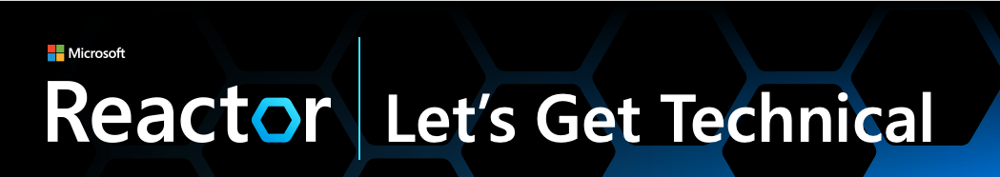

# Microsoft Let's Get Technical Series 

Here's how you can partner Microsoft Reactor and get started to landing a Let's Get Technical series in your market. 
 
## Background
The Let’s Get Technical is a series of three short 55-minute virtual events, delivering technical demos and know-hows on the latest technologies in Asia. Debuting in Indonesia, then the Philippines and recently in Thailand, this series focuses on the regional markets in Asia, and is now making its way to Singapore, Vietnam and the Greater China. 

Each event in the Let's Get Technical series is carefully curated and will feature a well-diversed group of guest speakers who are experts in their respective fields. They will share their insights, experiences, and thought-provoking ideas during interactive sessions.
 
## Objectives 
The 60 minute-event series is aimed to amplify the voices of our Community Leaders and Subject Matter Experts, and to engage developers from the local markets, help them to achieve success, and at the same time, grow awareness of our Reactor programs. 
 

👉 We are inviting you to partner with us to bring this series to your market, so that your voices of your local communities can be heard and the latest technologies can be brought to your market. 
 
## Processes 
| Tasks                                                 | Provision by The Reactor      | Provision by Subsidiary/Community Leader     |
| -------------------------------------------------     | ------------------------------| -------------------------------------------- |
| Event Structure/Consultation                          | x                             |                                              |
| Event Brief                                           |                               | x                                            |
| Creation of Registration Page                         | x                             |                                              |
| Provision of Microsoft Reactor Branding               | x                             |                                              |
| Provision of Speakers                                 | x (Cloud Advocates)           | x (Local Subject Matter Experts)             | 
| Creation of Content (Deck, promotional materials)     |                               | x                                            |
| Localisation of Code of Conduct                       |                               | x                                            |
| Resources                                             |                               | x                                            |
| Demand Generation                                     | x                             | x                                            |
| Weekly/Daily attendance updates                       | x                             |                                              |
| Runsheet and Pre-event guidance                       | x                             |                                              |
| Attendee Survey                                       | x                             |                                              |
| Onsite Production                                     | x                             |                                              |
| Post Event Report (Registration count, companies)     | x                             |                                              |

## Success Stories 
Here are the some examples of the Let's Get Technical series in the two markets. 
* [Let's Get Technical - Philippines](https://www.youtube.com/watch?v=fMBfQL7Tvkg)
* [Let's Get Technical - Thailand](https://www.youtube.com/watch?v=OdSF9ZcoYT0)  

Through these great partnership with the various markets, it also allowed further collaborations including the Thailand Developer Week where we partnered to deliver a week-long hybrid event to the local developers. 

## Quick start
1. Brainstorm latest trending topics in your markets.
   - Some topics that we discussed previously (latest as of June 2023)
2. Complete [brief](https://github.com/microsoft/Lets-Get-Technical/tree/main/assets/Lets-Get-Technical-Brief.docx) 
4. Refer to Calendar section below for a visibility of when it may be most ideal for your market
5. Send brief over to suzanne.chen@microsoft.com 
6. We'll be in touch in the next three working days to clarify and finalise details.
7. We'll work on event registration page once details are finalised. 

## Resources 
These are some resources you may find useful for localisation. 
* [Speakers invitation](https://github.com/microsoft/Lets-Get-Technical/tree/main/assets/Speakers-Invitation.docx)
* [Brand/Powerpoint Templates](https://github.com/microsoft/Lets-Get-Technical/tree/main/assets/Lets-Get-Technical-Cover-Slides.pptx) for your presentation
* Customisable [Promotional materials - Powerpoint decks](https://github.com/microsoft/Lets-Get-Technical/tree/main/assets/Lets-Get-Technical-Promo-Slides.pptx)
* Customisable [Invitation Emails](https://github.com/microsoft/Lets-Get-Technical/tree/main/assets/Let's-Get-Technical-Promo-Invitation-Mail.docx)
* Code of Conduct (in English) 

## Calendar
H1 of 2023 

| Event                      | Jan 2023             | Feb 2023             | Mar 2023             | Apr 2023             | May 2023             | Jun 2023             | 
| -------------------------- | -------------------- | -------------------- | -------------------- | -------------------- | -------------------- | -------------------- |
| Let's Get Technical        |  -                   | Indonesia            | Philippines          |                      | Thailand             | Singapore            |  

H2 of 2023
| Event                      | Jul 2023             | Aug 2023                        | Sep 2023             | Oct 2023             | Nov 2023             | Dec 2023             |
| -------------------------- | -------------------- | ------------------------------- | -------------------- | -------------------- | -------------------- | -------------------- |
| Let's Get Technical        | Vietnam              | Greater China, Indonesia        |                      |                      |                      | -                    |

 
